# Дипломная работа
### на тему "Разработка crm-системы для спортивно-оздоровительного центра "Растем вместе" на базе фреймворка Django"


## Введение


**Обоснование выбранной темы:**


Понаблюдав за работой администраторов филиалов СОЦ "Растем вместе", появилась идея создать crm-систему (веб приложение) под тематику данного предприятия. Так как:
1. ***Актуальность:*** Записи в филиалах СОЦ "Растем вместе" пишутся вручную в огромных количествах разных журналах. Администраторы филиалов ведут записи о клиентах такие, как:
   - ФИО клиента и номер телефона, если клиент заинтересован в пробном занятии по плаванью;
   - сделана ли справка, ФИО клиента и даты сдачи анализов и ее действия, комментарий;
   - запись на занятие (дата и время прихода, ФИО клиента, ФИО инструктора, который будет проводить занятие, комментарий). 


2. ***Потребности рынка:*** В условиях современного рынка услуг СОЦ "Растем вместе" столкнулся с необходимостью оптимизации своих бизнес-процессов для повышения эффективности работы сотрудников. 


3. ***Практическая значимость:*** Работа в области разработки crm-системы (веб приложения) позволит применить полученные знания на практике и закрепить полученный материал.


4. ***Личный интерес и потенциальные перспективы:*** Более глубокое изучение возможностей технологий и инструментов используемых в фреймворке Django для создания веб приложений. А в будущем даже внедрить данную систему в филиалы СОЦ "Растем вместе".

Таким образом выбор темы "Разработка crm-системы для спортивно-оздоровительного центра "Растем вместе" на базе фреймворка Django", обусловлен актуальностью, практической значимостью и личным интересом.


**Определение цели и задач исследования:**


***Цель исследования:*** Изучение предметной области (работа администратора филиала) и инструментов предоставляемые фреймворком Django для разработки crm-системы (веб приложения).


***Задачи исследования:***


1. Проанализировать работу администратора.


2. Спроектировать базу данных


3. Выбрать среду разработки базы данных и создать ее.


4. Углубленное изучение фреймворка Django и его возможностей для создания crm-системы (веб приложения).


5. Написание дипломной работы: Составить дипломную работу, включающую в себя введение, структуру системы, используемые инструменты, представление результатов.


Цели и задачи исследования направлены на получение практических результатов, а именно заготовку crm-системы (веб приложения).


## Основные понятия и определения


Обзор основных понятий в области тестирования эффективности предобученных моделей распознавания объектов:


1. Фреймворк (Framework): Программная платформа, которая предоставляет готовые компоненты и инструменты для разработки приложений. 


2. Веб-приложение (Web Application): Программное приложение, которое работает на веб-сервере и доступно через браузер.


3. CRM (Customer Relationship Management) система — это программное обеспечение, предназначенное для управления взаимоотношениями с клиентами. Основная цель CRM-системы — помочь компаниям управлять взаимодействиями с текущими и потенциальными клиентами, анализировать данные о клиентах и улучшать бизнес-процессы.


4. CSS (Cascading Style Sheets) — это язык стилей, используемый для описания внешнего вида HTML-документов. В контексте Django, CSS используется для стилизации шаблонов, чтобы улучшить внешний вид веб-приложений(crm-системы).

## Методы и подходы к разработке


**Проектирование базы данных**

Первым делом была спроектирована база данных для хранения информации о:
 - клиентах (ФИО, ФИО ребенка, телефон); 
 - справках (ФИО клиента/ребенка, тип справки, дата сдачи анализов, дата конца действия, комментарий);
 - посещении (ФИО клиента/ребенка, ФИО инструктора, дата прихода, время перехода, статус занятия(сгорело, перенесено, проведено), дата пропуска, дата переноса, время переноса, комментарий).


В приложении StarUML была спроектирована база данных продемонстрированая на рисунке 1.
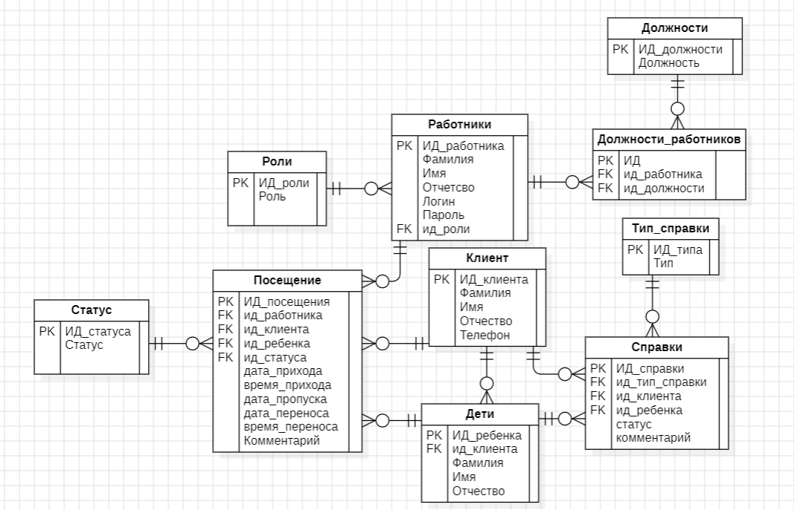
Рисунок 1 - Спроектированная база данных в StarUML


**Выбор среды разработки базы данных и разработка базы данных**


Для разработки базы данных был выбран "PostegreSQL".
PostgreSQL — это мощная и надежная СУБД, которая поддерживает сложные запросы, транзакции и множество других функций.

На рисунке 2 представлена разработанная база данных.

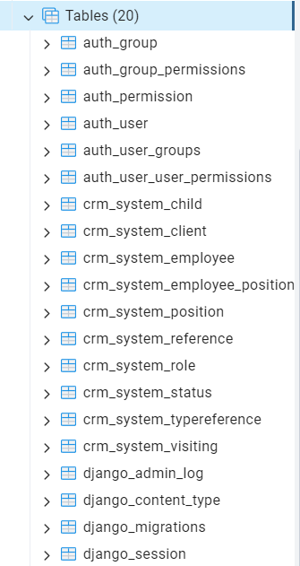

Рисунок 2 - Таблицы базы данных разработанные в PostgreSQL

**Инструменты Django**


1. ORM (Object-Relational Mapping):

   - Django ORM позволяет взаимодействовать с базой данных через Python-код, абстрагируя SQL-запросы.
   - Модели Django определяются как классы Python, которые затем мапятся на таблицы в базе данных.

   
2. Административная панель (Django Admin):

   - Автоматически генерируемая административная панель для управления данными моделей.
   - Позволяет легко добавлять, изменять и удалять записи в базе данных.

   
3. Маршрутизация URL (URL Routing):

    - Система для определения URL-адресов и их соответствия представлениям (views).

   
4. Представления (Views):

   - Функции или классы, которые обрабатывают запросы и возвращают ответы.
   - Поддержка функциональных представлений (Function-Based Views) и классовых представлений (Class-Based Views).

   
5. Шаблоны (Templates):

   - Система шаблонов для генерации HTML-кода.
   - Поддержка наследования шаблонов, фильтров и тегов.


6. Формы (Forms):

   - Инструменты для создания и обработки HTML-форм.
   - Поддержка валидации данных и защиты от атак.

   
7. Миграции (Migrations):

   - Система для управления изменениями в схеме базы данных.
   - Позволяет создавать, применять и откатывать миграции.


## Проектирование приложения

**Планирование и анализ требований**

***Выбор фреймворка и инструментов:*** фреймворк Django и его инструменты для разработки.

***Определение структуры приложения:*** Разработка схемы архитектуры, включающей фронтенд, бэкенд, базу данных.

***Реализация основного функционала:*** Создание базовой версии crm-системы с минимально необходимым функционалом для тестирования и демонстрации.

***Реализация пользовательского интерфейса:*** Создание форм и страниц для работы с данными клиентов.


**Основные требования**

***Вывод данных:*** Пользователь должен иметь возможность просматривать данные.

***Добавление данных:*** Пользователь должен иметь возможность добавлять новые данные.

***Редактирование данных:*** Пользователь должен иметь возможность редактировать существующие данные.


**Технические требования**

***Фронтенд:*** использовать HTML-шаблоны, CSS-стили.

***Бэкенд:*** Python с использованием фреймворков Django.

***База данных:*** Использование базы данных PostgreSQL для хранения данных о клиентах, справках, расписании(посещении).

## Структура программы

**Фронтенд**

Проект включает следующие ключевые компоненты:

**Страница авторизации (рисунок 3)**

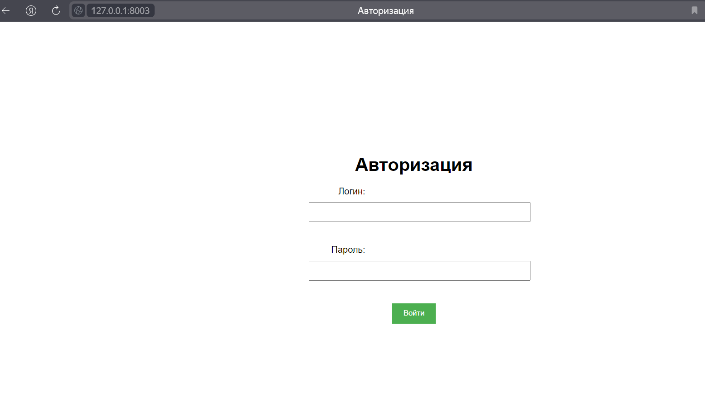
Рисунок 3 - Страница авторизации

При вводе логина и пароля происходит проверка правильности введенных данных и есть ли они в базе.

Если есть (и корректно введен) и логин привязан к роли "Инструктор", то открывается главная страница "Инструктора" (рисунок 4).
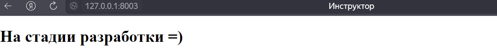
Рисунок 4 - Главная страница инструктора

Если есть (и корректно введен) и логин привязан к роли "Администратор", то открывается страница "Администратора" (рисунок 5).
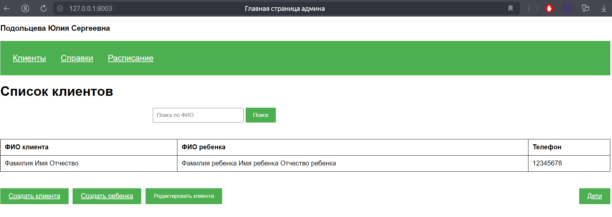
Рисунок 5 - Главная страница администратора

На данной странице пользователь может добавить нового клиента, добавить ребенка, редактировать клиента, с помощью поиска быстро найти нужного клиента. 

Перейти на страницы:
 - со списком детей (нажав на кнопку "Дети"), 
 - со списком справок (нажав на "Справки"), 
 - со списком посещения занятий (нажав на "Расписание").


**Страница список детей (рисунок 6)**

На данной странице пользователь может добавить запись ребенка, редактировать запись ребенка и вернуть назад (на страницу "Список клиентов"), а также найти ребенка через поисковую строку.
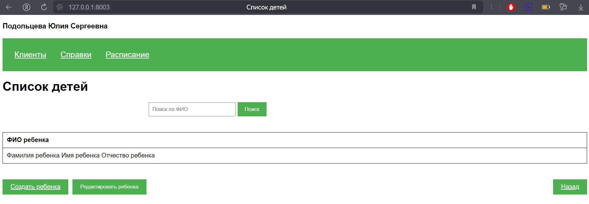
Рисунок 6 - Страница список детей

**Страница создать клиента (рисунок 7)**

Пользователь может ввести ФИО и номер телефона клиента в соответствующие ячейки.
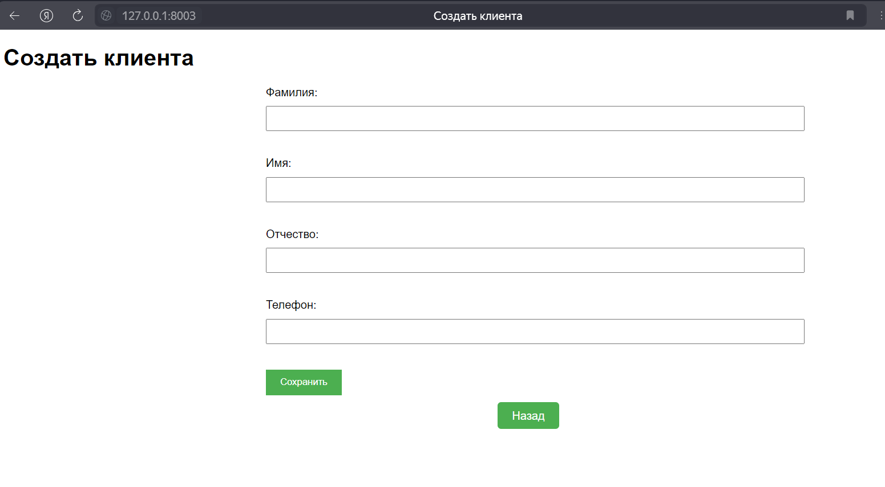
Рисунок 7- Страница создать клиента  


**Страница добавления ребенка (рисунок 8)**

На данной странице пользователь может создать запись о ребенке и привязать его к клиенту, который уже внесен в базу.

При нажатии кнопки назад происходи возврат на страницу "Список клиентов".
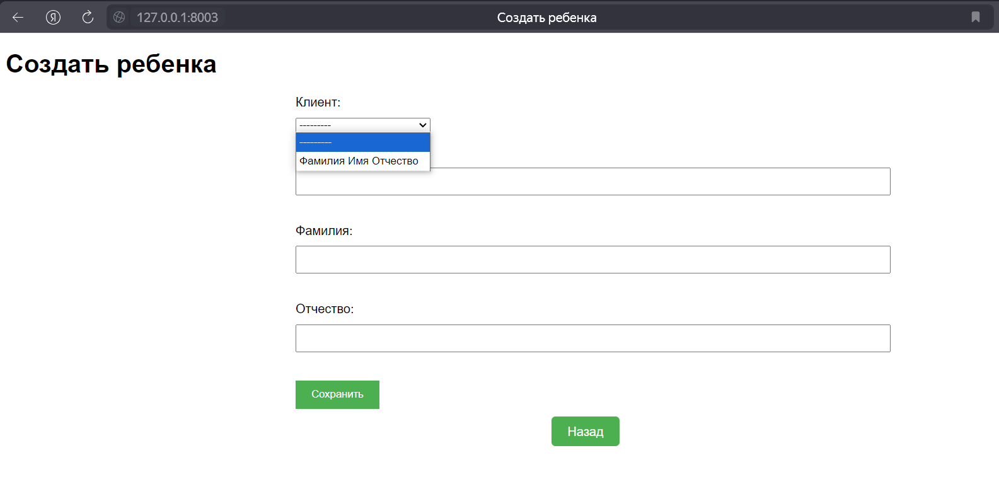
Рисунок 8 - Страница добавления ребенка


**Страница редактировать клиента (рисунок 9)**

На данной странице пользователь может редактировать уже созданные данные в базе (необходимо выбрать строку в таблице, а затем нажать на кнопку редактирования).

При нажатии кнопки назад происходи возврат на страницу "Список клиентов".
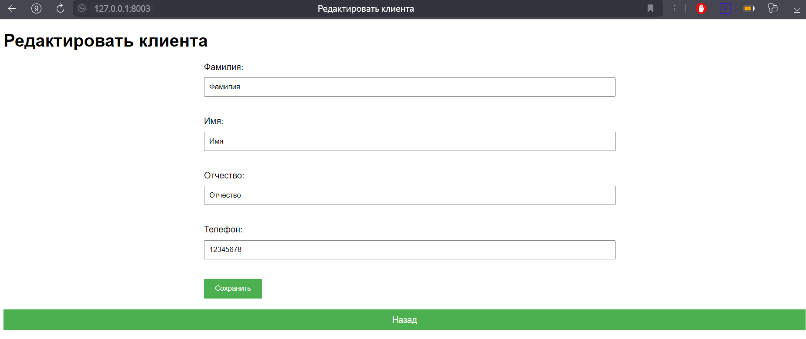
Рисунок 9 - Страница редактировать клиента


**Страница редактирования ребенка (рисунок 10)**

На данной странице пользователь может редактировать уже созданные данные в базе (необходимо выбрать строку в таблице, а затем нажать на кнопку редактирования).

При нажатии кнопки назад происходи возврат на страницу "Список детей".
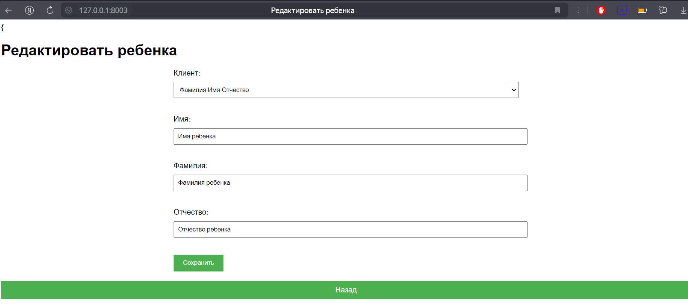
Рисунок 10 - Страница редактирования ребенка


**Страница список справок (рисунок 11)**

На данной странице пользователь может добавить запись справки, редактировать запись справки и перейти на страницу ("Список справок для детей"), а также найти клиента по его ФИО, типе справки, дате сдачи анализа, дате конца действия справки через поисковую строку.

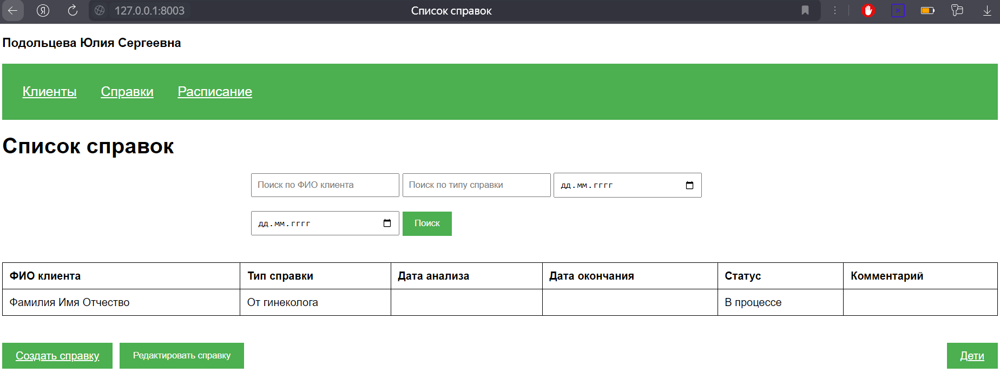
Рисунок 11 - Страница список справок


**Страница создания записи справки (рисунок 12)**

На данной странице пользователь может добавить запись справки для клиента.

Если справка находится в процессе (получения), то даты должны быть пустыми, если статус "Готова", то обязательно должны быть прописаны даты.
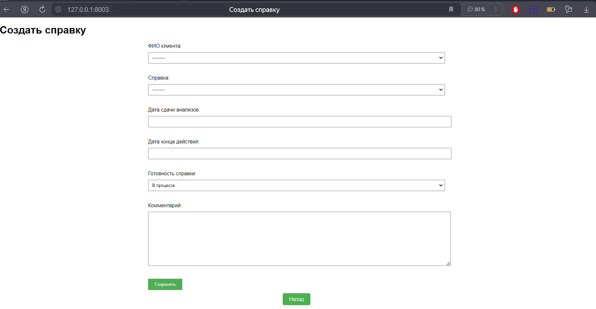
Рисунок 12 - Страница создания записи справки


При нажатии на поле для ввода даты откроется календарь.
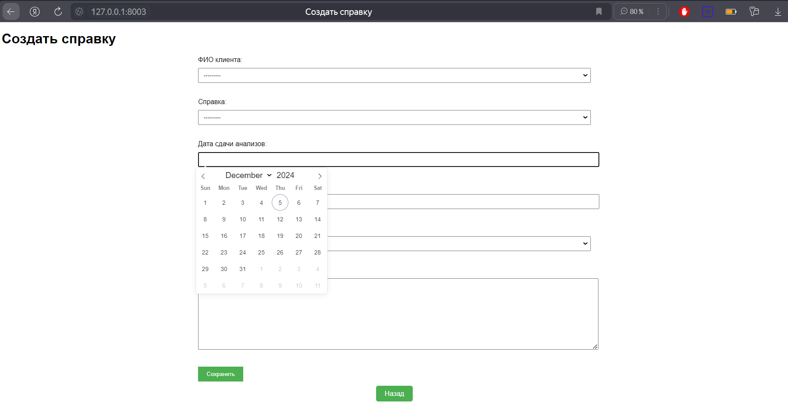
Рисунок 13 - Страница создания записи справки (календарь)


**Страница список справок для детей (рисунок 14)**

На данной странице пользователь может добавить запись справки, редактировать запись справки и вернуться назад (перейти на страницу "Список справок"), а также найти ребенка по его ФИО, типе справки, дате сдачи анализа, дате конца действия справки через поисковую строку.

При нажатии на кнопку "Создать справку" открывается аналогичная страница как на рисунке 12 (вместо ФИО клиента - ФИО ребенка).

При нажатии на кнопку "Редактировать справку" открывается аналогичная страница как на рисунке 15 (вместо ФИО клиента - ФИО ребенка).

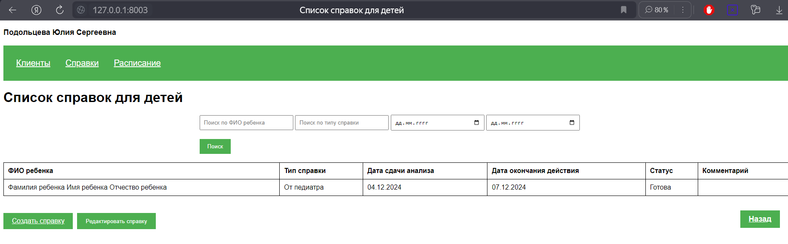
Рисунок 14 - Страница список справок для детей


**Страница редактирования справки (рисунок 15)**

На данной странице пользователь может редактировать уже созданные данные в базе (необходимо выбрать строку в таблице, а затем нажать на кнопку редактирования).

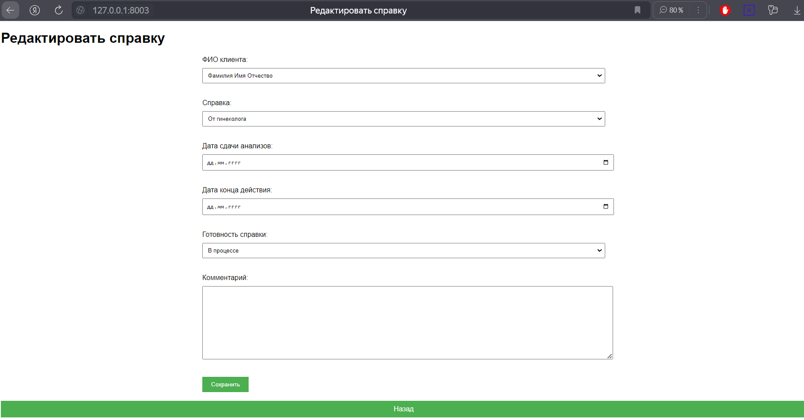
Рисунок 15 - Страница редактирования справки


**Страница списка посещений (рисунок 16)**

На данной странице пользователь может добавить запись посещения, редактировать запись посещения и перейти на страницу "Список посещения детей", а также найти клиента по его ФИО, ФИО инструктора, дате прихода, времени прихода через поисковую строку.

Выпадающий список времени аналогичный как на рисунке 18.
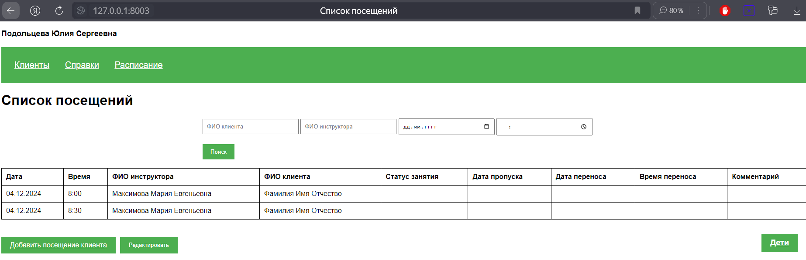
Рисунок 16 - Страница списка посещений


**Страница добавления посещения (рисунок 17)**

На данной странице пользователь может добавить запись посещения.

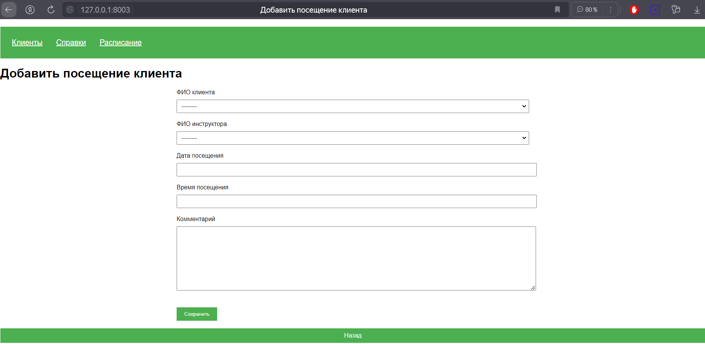
Рисунок 17 - Страница добавления посещения

При нажатии на поле ввода времени выпадает список для настройки времени.

При нажатии на поле ввода даты открывается календарик как на рисунке 13.
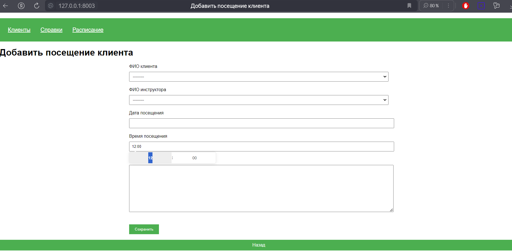
Рисунок 18 - Страница добавления посещения(список времени)

На данной странице пользователь может редактировать уже созданные данные в базе (необходимо выбрать строку в таблице, а затем нажать на кнопку редактирования).

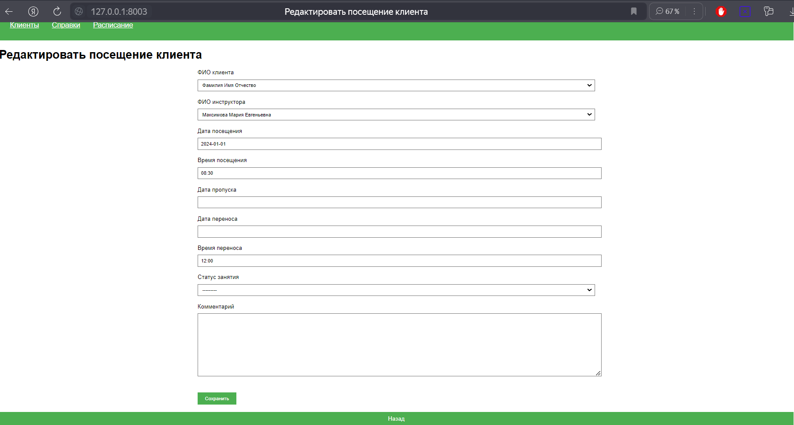
Рисунок 19 - Страница редактирования посещения клиента


**Страница список посещений детей (рисунок 20)**

При нажатии на кнопку "Добавить посещение ребенка" открывается аналогичная страница как на рисунке 17 (вместо ФИО клиента - ФИО ребенка).

При нажатии на кнопку "Редактировать" открывается аналогичная страница как на рисунке 19 (вместо ФИО клиента - ФИО ребенка).

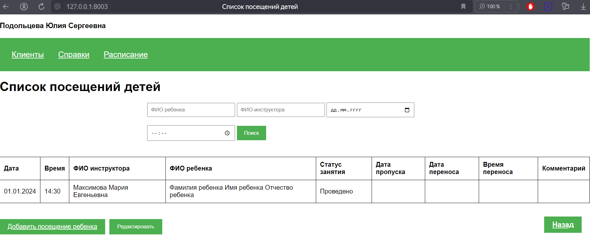
Рисунок 20 - Страница список посещений детей


**Бэкенд**

Реализована серверная логика с использованием фреймворка Django.

Настроены маршруты для вывода данных, добавления данных, редактирование данных.

**Файловая структура приложения**
```
├───crm_system
│   │   admin.py
│   │   apps.py
│   │   forms.py
│   │   models.py
│   │   tests.py
│   │   views.py
│   │   __init__.py
│   │
│   ├───migrations
│   │   │   0001_initial.py
│   │   │   0002_rename_id_type_of_reference_reference_type_of_reference.py
│   │   │   0003_alter_reference_client.py
│   │   │   0004_position_employee_delete_users.py
│   │   │   0005_status.py
│   │   │   0006_visiting.py
│   │   │   0007_alter_status_status.py
│   │   │   0008_alter_status_status.py
│   │   │   0009_alter_status_status.py
│   │   │   0010_alter_visiting_unique_together.py
│   │   │   __init__.py
│
├───static
│   └───css
│           styles.css
│
├───templates
│   │   admin_home.html
│   │   authorization.html
│   │   base.html
│   │   instructor_home.html
│   │
│   ├───create
│   │   ├───list
│   │   │       create_child.html
│   │   │       create_client.html
│   │   │
│   │   ├───reference
│   │   │       create_reference.html
│   │   │       create_reference_child.html
│   │   │
│   │   └───visiting
│   │           add_child_visiting.html
│   │           add_client_visiting.html
│   │
│   ├───edit
│   │   ├───list
│   │   │       edit_child.html
│   │   │       edit_client.html
│   │   │
│   │   ├───reference
│   │   │       edit_reference.html
│   │   │       edit_reference_child.html
│   │   │
│   │   └───visiting
│   │           edit_child_visiting.html
│   │           edit_client_visiting.html
│   │
│   └───list
│       ├───list
│       │       child_list.html
│       │
│       ├───reference
│       │       reference_child_list.html
│       │       reference_list.html
│       │
│       └───visiting
│               visiting_child_list.html
│               visiting_list.html
│
└───Растем_вместе
    │   asgi.py
    │   settings.py
    │   urls.py
    │   wsgi.py
    │   __init__.py
```


